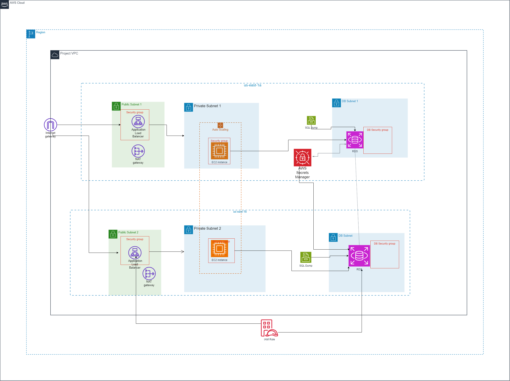

Here’s an updated `README.md` file for the Architecture Diagram of your AWS Academy Cloud Architecting Capstone Project, incorporating information from the uploaded architecture diagram:

---

# Architecture Diagram for AWS Academy Cloud Architecting Capstone Project

## Project Overview  
This repository contains the architecture diagram for the Cloud Architecting Capstone Project, demonstrating a highly available, scalable, and secure AWS solution. The solution is designed to follow AWS best practices, focusing on security, cost-effectiveness, and performance optimization.

## Architecture Description  
The architecture includes the following components:

1. **Amazon VPC**: Provides an isolated and secure network environment for the project.
   - **Public and Private Subnets**: Public subnets host internet-facing resources, while private subnets securely house the application and database servers.
   - **NAT Gateway**: Enables internet access for resources in private subnets for updates without exposing them directly to the internet.
   
2. **Internet Gateway**: Allows external access to resources in public subnets.

3. **Application Load Balancer (ALB)**: Distributes incoming traffic across multiple EC2 instances located in private subnets across two Availability Zones, ensuring high availability and fault tolerance.

4. **Amazon EC2**: Runs the application servers in an auto-scaling configuration to handle varying traffic loads.

5. **Amazon RDS**: Hosts a MySQL database in a Multi-AZ deployment for high availability and data durability.

6. **IAM Roles and Policies**: Enforce least-privilege access to AWS resources, ensuring secure access management across the architecture.

7. **Security Groups and Network ACLs**: Control inbound and outbound traffic at the subnet and instance level, respectively, adding an additional layer of security.

8. **AWS Secrets Manager**: Manages sensitive information, such as database credentials, in a secure and encrypted manner.

## Architecture Diagram  
  
*(Replace with the path to your architecture diagram image)*

## Deployment Notes  
- **Security**: 
  - All resources are provisioned within a VPC with strict access control.
  - Only the ALB and CloudFront are public-facing, while application servers and databases are kept in private subnets.
  - Security groups, NACLs, and IAM roles enforce a secure and controlled environment for each component.
  
- **Scalability and High Availability**:
  - The architecture leverages multiple Availability Zones and auto-scaling for EC2 instances to ensure high availability and handle traffic fluctuations.
  - The Multi-AZ RDS setup provides database redundancy and failover support.

- **Cost Optimization**:
 
  - On-demand instances are used for flexibility, with potential to integrate spot instances or reserved instances for cost savings.

## Updates  
This architecture diagram and documentation will be updated based on feedback and iterative improvements as the project progresses.

## Additional Resources  
For a detailed explanation of the AWS services and best practices used in this project, refer to the [AWS Documentation](https://docs.aws.amazon.com).  

---

This updated `README.md` file incorporates specific details from your architecture diagram to provide a comprehensive description of each AWS component and its role in the solution.
