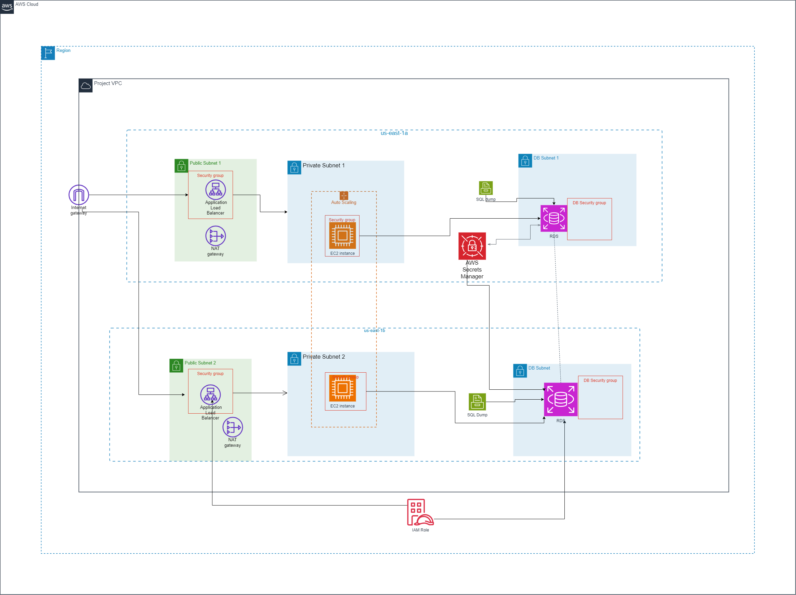

Here's a structured README file based on the provided rubric and using the details of your project:

---

# AWS Cloud Architecting Capstone Project
A repository for the final capstone project of the AWS Academy Cloud Architecting Course

## Introduction

### 1. Project Title
**Cloud Architecting Capstone Project: Scalable High Availability E-commerce Application**

### 2. Project Overview
This project demonstrates the design and deployment of a scalable and highly available cloud infrastructure on AWS for an e-commerce application. The architecture leverages multiple AWS services to provide a secure, resilient, and cost-effective solution. Key components include VPC, subnets, load balancers, EC2 instances, and security services.

- **Problem:** Building a reliable, high-availability infrastructure to handle fluctuating e-commerce traffic.
- **Solution Importance:** Ensures consistent user experience with minimal downtime and optimized costs.
- **Primary Architecture:** Multi-AZ VPC with public, private, and database subnets, autoscaling EC2 instances, and NAT gateways for internet access.

---

## Architecture Diagram
Below is the cloud architecture diagram designed for this project. The diagram was created using **Draw.io** and outlines the key AWS components within the architecture, such as VPC, subnets, internet gateway, NAT gateway, application servers, and security roles.

**Checklist:**
- **Components:** VPC, public and private subnets, NAT gateway, internet gateway, EC2 instances, and RDS database.
- **Security Services:** IAM roles, security groups, and NACLs.
- **Flow of Data:** Clearly illustrates data flow from public subnets to private subnets and the database layer in a secure manner.

---

## Features and Functionality

### 1. Key Features
- **Autoscaling:** Automatically adjusts the number of instances based on incoming traffic.
- **High Availability:** Configured with multi-AZ deployment for resiliency.
- **Cost Optimization:** Utilizes reserved instances and scalable resources to manage costs effectively.

### 2. AWS Services Used
- **Amazon VPC:** Provides isolated networking with custom subnets and routing.
- **Amazon EC2:** Hosts the application servers with autoscaling configured.
- **Amazon RDS:** Managed relational database for data storage.
- **Amazon S3:** Stores static assets such as images and files.
- **Amazon IAM:** Manages access to resources with role-based permissions.
- **Amazon CloudWatch:** Monitors and logs infrastructure performance.

---

## Deployment

### 1. Prerequisites
- **AWS CLI** installed and configured on your local machine.
- IAM user with sufficient privileges for resource creation.
- **Draw.io** or any diagramming tool to edit architecture.

### 2. Step-by-Step Deployment Instructions
1. **Set up VPC:** Create a new VPC and configure public and private subnets across two availability zones.
2. **Deploy Internet Gateway and NAT Gateway:** Attach an internet gateway to the VPC and configure a NAT gateway in the public subnet.
3. **Launch EC2 Instances:** Configure auto-scaling groups and security groups to manage incoming traffic.
4. **Set up RDS Database:** Deploy an RDS instance in a private subnet with proper security configurations.
5. **Configure IAM Roles and Security Policies:** Apply least-privilege IAM roles to resources as needed.

---

## Security

- **IAM Roles:** Implemented role-based access control to ensure least privilege.
- **Network Security:** Configured security groups and NACLs to restrict access to public and private resources.

---

## Testing and Validation

### 1. Testing Strategy
- **Load Testing:** Simulated high traffic to validate autoscaling functionality .
- **Failover Testing:** Tested high availability by simulating an AZ failure.

---

## Challenges and Learnings

- **Challenge:** Configuring cross-zone load balancing with the ALB.
- **Learning:** Gained practical skills in setting up AWS networking services, including internet and NAT gateways for isolated subnets.

---

## Future Improvements

- **Implement CI/CD:** Use AWS CodePipeline to automate application deployment.
- **Enhanced Monitoring:** Incorporate CloudWatch Insights for deeper analysis of application performance.

---

## Contributors

- **Lauvendah Nekesa** - Architecture Design, Documentation.

---

## License

--- 

This README.md structure ensures clarity, professionalism, and thoroughness for presenting your project. Add any additional specifics or screenshots to enhance the document.
